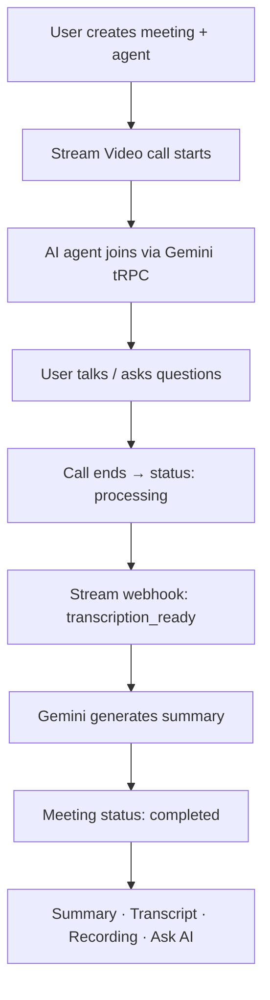
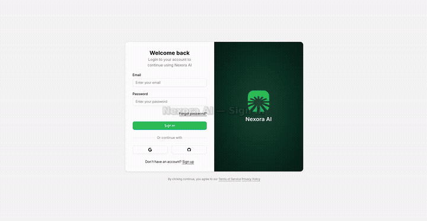

# Nexora AI

**AI-powered video meeting platform** — create custom AI agents, join live video calls, and get automatic meeting summaries, transcripts, and recordings.

**Live:** [https://nexora-ai-1qwb.vercel.app](https://nexora-ai-1qwb.vercel.app)

---

## Features

- **AI Agents** — Create agents with custom instructions (interview coach, tutor, sales assistant, etc.)
- **Video Meetings** — HD video calls powered by [Stream Video](https://getstream.io/video/)
- **In-call AI Assistant** — Text or voice questions answered by Gemini during the call
- **Auto Transcription & Recording** — Enabled automatically when a meeting starts
- **AI Meeting Summary** — Gemini generates a structured markdown summary after each call
- **Post-meeting Dashboard** — Summary, transcript, recording, and Ask AI tabs
- **Authentication** — Email/password, Google, and GitHub via [Better Auth](https://www.better-auth.com/)

---

## Tech Stack

| Layer | Technology |
|-------|------------|
| Framework | [Next.js 15](https://nextjs.org/) (App Router) |
| Language | TypeScript |
| Styling | Tailwind CSS 4, Radix UI |
| API | [tRPC](https://trpc.io/) |
| Database | [Neon](https://neon.tech/) PostgreSQL + [Drizzle ORM](https://orm.drizzle.team/) |
| Auth | [Better Auth](https://www.better-auth.com/) |
| Video | [Stream Video SDK](https://getstream.io/video/) |
| AI | [Google Gemini](https://ai.google.dev/) (`gemini-2.0-flash-lite` with fallbacks) |
| Background Jobs | [Inngest](https://www.inngest.com/) |
| Deployment | [Vercel](https://vercel.com/) |

---

## How It Works



---

## Getting Started

### Prerequisites

- Node.js 20+
- npm
- Accounts: [Neon](https://neon.tech), [Stream](https://getstream.io), [Google AI Studio](https://aistudio.google.com), [Inngest](https://www.inngest.com) (optional for local dev)

### 1. Clone & install

```bash
git clone https://github.com/coder-Yash886/Meet-Ai.git
cd .
npm install
```

### 2. Environment variables

Create a `.env` file in the project root:

```env
# Database
DATABASE_URL=postgresql://...

# Auth
BETTER_AUTH_SECRET=your-random-secret
BETTER_AUTH_URL=http://localhost:3000
NEXT_PUBLIC_APP_URL=http://localhost:3000

# OAuth
GITHUB_CLIENT_ID=
GITHUB_CLIENT_SECRET=
GOOGLE_CLIENT_ID=
GOOGLE_CLIENT_SECRET=

# Stream Video
NEXT_PUBLIC_STREAM_VIDEO_API_KEY=
STREAM_VIDEO_SECRET_KEY=

# Gemini AI
GEMINI_API_KEY=

# Inngest (optional for local)
INNGEST_SIGNING_KEY=
```

### 3. Database setup

```bash
npm run db:push
```

### 4. Run locally

**Minimal (app only):**

```bash
npm run dev
```

Open [http://localhost:3000](http://localhost:3000) — redirects to `/meetings`.

**Full flow (summary + webhooks):**

```bash
# Terminal 1
npm run dev

# Terminal 2 — expose webhooks to Stream
npm run dev:webhook

# Terminal 3 — Inngest dev server (optional)
npm run dev:inngest
```

---

## Project Structure

```
src/
├── app/
│   ├── (auth)/              # Sign-in, sign-up, dashboard
│   │   └── (dashboard)/
│   │       ├── meetings/    # Meeting list & detail
│   │       └── agents/      # Agent management
│   ├── call/[meetingId]/    # Live video call UI
│   └── api/
│       ├── auth/            # Better Auth routes
│       ├── trpc/            # tRPC handler
│       ├── webhook/         # Stream Video webhooks
│       └── inngest/         # Inngest functions
├── modules/
│   ├── agents/              # Agent CRUD & UI
│   ├── meetings/            # Meetings, summary, transcript
│   ├── call/                # Video call components
│   ├── auth/                # Login / signup views
│   └── dashboard/           # Sidebar & navbar
├── db/                      # Drizzle schema
├── inngest/                 # Background job definitions
└── lib/                     # Auth, Gemini, Stream helpers
```

---

## Key Routes

| Route | Description |
|-------|-------------|
| `/meetings` | Meeting list (default landing page) |
| `/meetings/[id]` | Meeting detail — upcoming, active, processing, or completed |
| `/agents` | Manage AI agents |
| `/call/[meetingId]` | Live video call with AI agent |
| `/sign-in` | Authentication |

---

## Deployment (Vercel)

### 1. Push to GitHub

```bash
git push origin main
```

### 2. Import on Vercel

- Framework: **Next.js**
- Build command: `npm run build`
- Install command: `npm install`

### 3. Environment variables

Set all `.env` variables in Vercel → **Settings → Environment Variables** for **Production**:

```env
BETTER_AUTH_URL=https://your-app.vercel.app
NEXT_PUBLIC_APP_URL=https://your-app.vercel.app
# ... all other vars from .env
```

Redeploy after adding env vars.

### 4. OAuth redirect URIs

**Google Cloud Console** → Authorized redirect URIs:

```
https://your-app.vercel.app/api/auth/callback/google
```

**GitHub OAuth App** → Authorization callback URL:

```
https://your-app.vercel.app/api/auth/callback/github
```

### 5. Stream Video webhook

[Stream Dashboard](https://dashboard.getstream.io) → **Video & Audio** → Webhooks:

```
https://your-app.vercel.app/api/webhook
```

Enable events: `call.session_ended`, `call.transcription_ready`, `call.recording_ready`

### 6. Inngest (recommended for production)

[Inngest Dashboard](https://app.inngest.com) → Create app `meet-ai-2` → Sync:

```
https://your-app.vercel.app/api/inngest
```

Add `INNGEST_SIGNING_KEY` to Vercel env and redeploy.

### 7. Verify OAuth

After deploy, open:

```
https://your-app.vercel.app/api/auth/debug
```

Confirm `googleRedirectURI` matches Google Console exactly.

---

## Scripts

| Command | Description |
|---------|-------------|
| `npm run dev` | Start dev server |
| `npm run build` | Production build |
| `npm run start` | Start production server |
| `npm run lint` | ESLint |
| `npm run db:push` | Push schema to Neon |
| `npm run db:studio` | Open Drizzle Studio |
| `npm run dev:webhook` | ngrok tunnel for Stream webhooks |
| `npm run dev:inngest` | Inngest local dev server |

---

## Meeting Lifecycle

| Status | Description |
|--------|-------------|
| `upcoming` | Created, not started |
| `active` | Call in progress |
| `processing` | Call ended, summary generating |
| `completed` | Summary, transcript & recording ready |
| `cancelled` | Meeting cancelled |

---

## Troubleshooting

| Issue | Fix |
|-------|-----|
| Google `redirect_uri_mismatch` | Match `BETTER_AUTH_URL` with Google Console redirect URI exactly |
| Summary stuck on processing | Check Stream webhook + `GEMINI_API_KEY`; visit processing page to trigger retry |
| Gemini quota exceeded | Wait 1 min or use a new key from [AI Studio](https://aistudio.google.com/apikey) |
| Agent not replying | Verify `GEMINI_API_KEY` is set (`AIzaSy...` format) |
| Webhook 401 | Check `STREAM_VIDEO_SECRET_KEY` on Vercel |

---

## Adding demo video & screenshots

Follow these steps to add your own media to this README.

### 1. Create folders (already set up)

```
docs/
├── assets/          # Demo GIF or short MP4
└── screenshots/     # App screenshots (PNG recommended)
```

### 2. Add screenshots

1. Take screenshots of your app (Meetings, Call, Summary, Agents).
2. Save as PNG — e.g. `meetings.png`, `call.png`, `summary.png`.
3. Put files in `docs/screenshots/`.
4. They will show automatically in the **Demo** section above.

**Tip:** Use [cleanshot](https://cleanshot.com/) or Windows Snipping Tool. Recommended width: **1280px**.

### 3. Add demo video (pick one option)

**Option A — YouTube (recommended for long demos)**

1. Upload video to YouTube (can be **Unlisted**).
2. Copy the video ID from the URL: `youtube.com/watch?v=VIDEO_ID`
3. Update the demo link in the **Demo** section at the top of this README.

**Option B — GIF (best for GitHub README)**

1. Record a short screen capture (15–30 seconds).
2. Convert to GIF using [ezgif.com](https://ezgif.com/video-to-gif) or similar.
3. Save as `docs/assets/demo.gif`.
4. Uncomment this line in the Demo section:
   ```markdown
   
   ```

**Option C — Direct video file**

GitHub does not play `.mp4` inside README. Host on YouTube/Vimeo and link to it, or use a GIF instead.

### 4. Commit and push

```bash
git add docs/screenshots docs/assets README.md
git commit -m "Add project demo and screenshots"
git push origin main
```

Images will appear on your GitHub repo homepage automatically.

---

## Author

**Yash Kumar** — [GitHub](https://github.com/coder-Yash886)

---

## License

MIT
