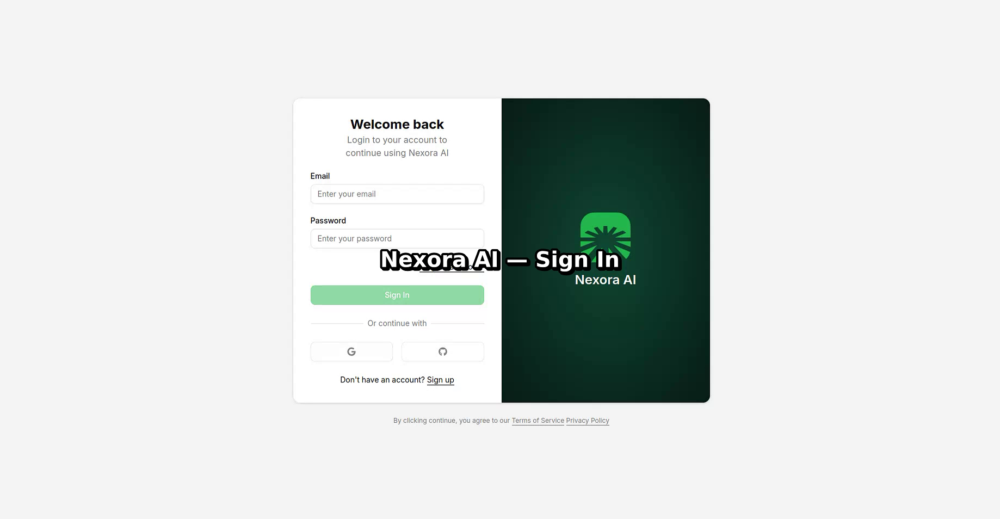
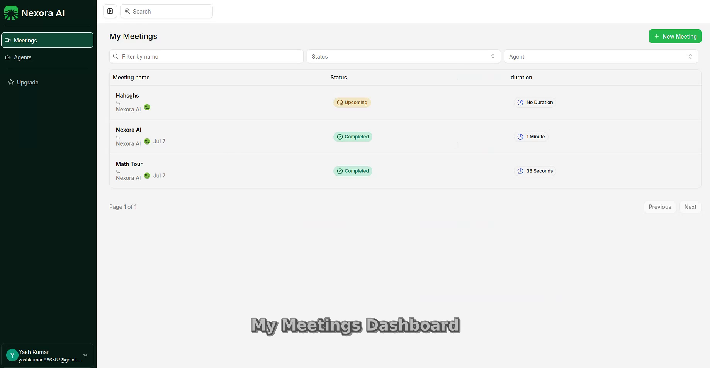
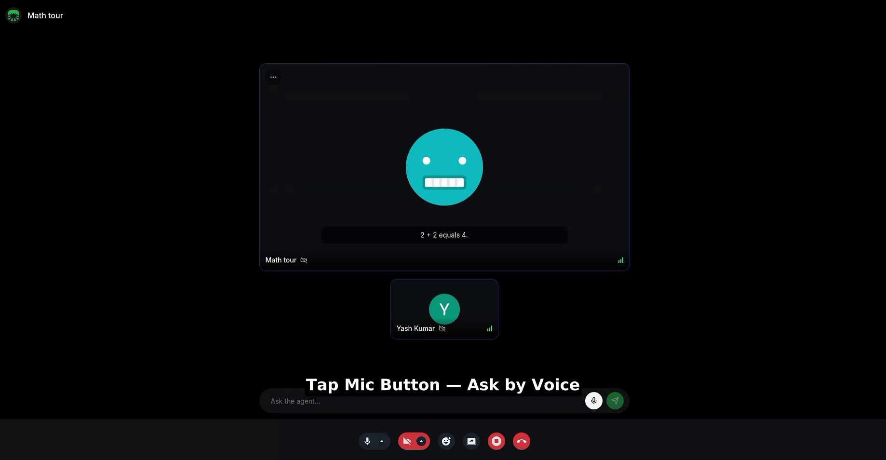
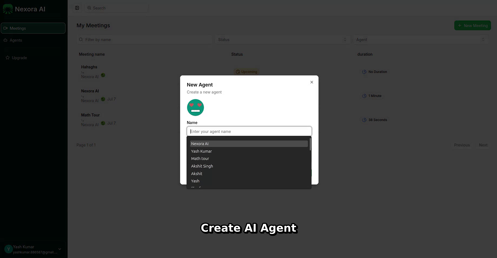
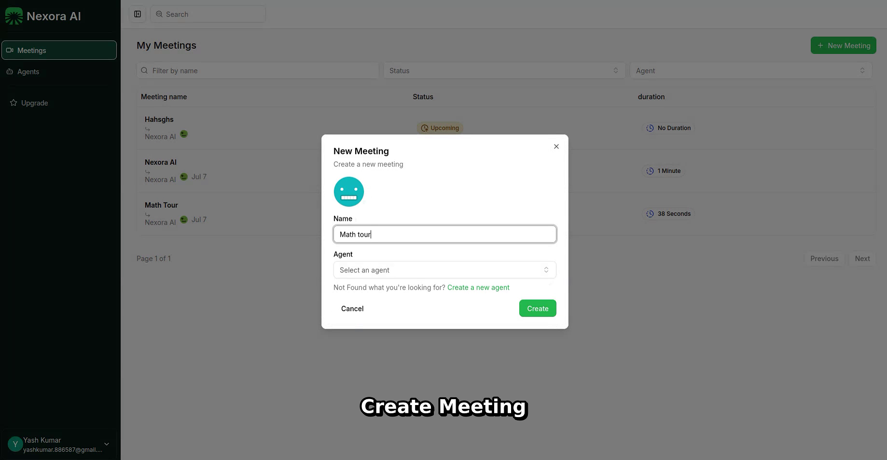
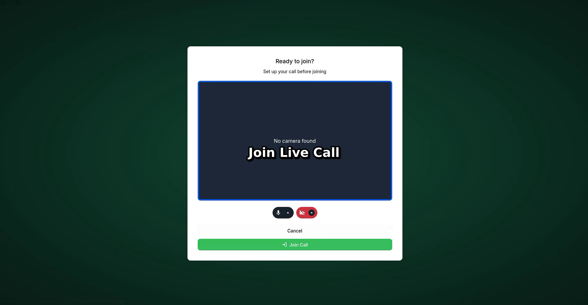
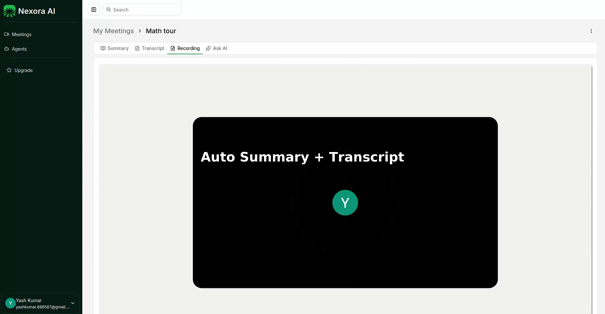

<p align="center">
  
</p>

<h1 align="center">Nexora AI</h1>

<p align="center">
  <strong>Your AI-Powered Video Meeting Platform</strong>
</p>

<p align="center">
  <a href="https://nextjs.org/"></a>
  <a href="https://www.typescriptlang.org/"></a>
  <a href="https://trpc.io/"></a>
  <a href="https://getstream.io/video/"></a>
  <a href="https://ai.google.dev/"></a>
  <a href="LICENSE"></a>
</p>

<p align="center">
  Create custom AI agents. Join HD video calls. Get instant summaries. 🔥
</p>

<p align="center">
  <a href="https://nexora-ai-1qwb.vercel.app"><strong>🚀 Live Demo</strong></a>
</p>

## 🎥 Demo Video

Experience Nexora AI in action:

https://github.com/coder-Yash886/Meet-Ai/raw/main/public/demo/nexora-ai-demo-final.mp4

---

| Sign In | Dashboard | AI Agent Call |
|:---:|:---:|:---:|
|  |  |  |

---

## ✨ Features That Slap

### 🤖 Custom AI Agents

| | |
|---|---|
| 🧠 | Create agents with custom instructions |
| 🎯 | Interview coach, tutor, sales assistant & more |
| ⚡ | Agents join your live video calls |

### 📹 HD Video Meetings

| | |
|---|---|
| 🎥 | Crystal-clear video powered by Stream |
| 🎙️ | Auto transcription & recording |
| 👥 | Real-time collaboration |

### 💬 In-Call AI Assistant

| | |
|---|---|
| 🗣️ | Ask questions by **voice** or **text** |
| ⚡ | Gemini replies in seconds |
| 🧩 | Context-aware answers during the call |

### 📊 Post-Meeting Intelligence

| | |
|---|---|
| 📝 | AI-generated markdown summaries |
| 📜 | Full meeting transcripts |
| 🎬 | Recording playback |
| 💡 | Ask AI about past meetings |

### 🔐 Authentication

| | |
|---|---|
| ✉️ | Email & password |
| 🔵 | Google sign-in |
| ⚫ | GitHub sign-in |

---

## 📱 Screenshots

| Create Agent | Create Meeting | Join Call |
|:---:|:---:|:---:|
|  |  |  |

| Meeting Summary |
|:---:|
|  |

---

## 🛠️ Tech Stack

| Technology | Purpose |
|------------|---------|
| [Next.js 15](https://nextjs.org/) | App framework (App Router) |
| [TypeScript](https://www.typescriptlang.org/) | Type-safe development |
| [Tailwind CSS 4](https://tailwindcss.com/) | Styling |
| [tRPC](https://trpc.io/) | End-to-end typesafe API |
| [Drizzle ORM](https://orm.drizzle.team/) | Database ORM |
| [Neon PostgreSQL](https://neon.tech/) | Serverless database |
| [Better Auth](https://www.better-auth.com/) | Authentication |
| [Stream Video SDK](https://getstream.io/video/) | HD video calls |
| [Google Gemini](https://ai.google.dev/) | AI agent & summaries |
| [Inngest](https://www.inngest.com/) | Background jobs |
| [Vercel](https://vercel.com/) | Deployment |

---

## 🚀 Getting Started

### Prerequisites

- Node.js 20+
- npm
- Accounts: [Neon](https://neon.tech), [Stream](https://getstream.io), [Google AI Studio](https://aistudio.google.com)

### Installation

```bash
# Clone the repo
git clone https://github.com/coder-Yash886/Meet-Ai.git
cd Meet-Ai/meetai

# Install dependencies
npm install

# Push database schema
npm run db:push

# Start dev server
npm run dev
```

Open [http://localhost:3000](http://localhost:3000) → redirects to `/meetings`.

### Environment Variables

Create a `.env` file in the `meetai` folder:

```env
DATABASE_URL=postgresql://...
BETTER_AUTH_SECRET=your-random-secret
BETTER_AUTH_URL=http://localhost:3000
NEXT_PUBLIC_APP_URL=http://localhost:3000
GITHUB_CLIENT_ID=
GITHUB_CLIENT_SECRET=
GOOGLE_CLIENT_ID=
GOOGLE_CLIENT_SECRET=
NEXT_PUBLIC_STREAM_VIDEO_API_KEY=
STREAM_VIDEO_SECRET_KEY=
GEMINI_API_KEY=
```

**Full local flow** (summaries + webhooks):

```bash
npm run dev          # Terminal 1
npm run dev:webhook  # Terminal 2 — ngrok for Stream webhooks
npm run dev:inngest  # Terminal 3 — optional
```

---

## 🏗️ Architecture

```
meetai/
├── 📱 src/app/
│   ├── (auth)/              # Sign-in, dashboard
│   │   └── (dashboard)/
│   │       ├── meetings/    # Meeting list & detail
│   │       └── agents/      # Agent management
│   ├── call/[meetingId]/    # Live video call UI
│   └── api/                 # Auth, tRPC, webhooks, Inngest
├── 🧠 src/modules/
│   ├── agents/              # Agent CRUD & UI
│   ├── meetings/            # Meetings, summary, transcript
│   ├── call/                # Video call + AI agent UI
│   └── auth/                # Login / signup views
├── 📦 src/db/               # Drizzle schema
├── ⚙️ src/lib/              # Auth, Gemini, Stream helpers
├── 🎬 public/demo/          # Demo video
└── 📸 public/feature/       # App screenshots
```

---

## 🗺️ Key Routes

| Route | Description |
|-------|-------------|
| `/meetings` | Meeting list (default landing) |
| `/meetings/[id]` | Meeting detail & summary |
| `/agents` | Manage AI agents |
| `/call/[meetingId]` | Live video call with AI |
| `/sign-in` | Authentication |

---

## ☁️ Deploy on Vercel

1. Push to GitHub and import on [Vercel](https://vercel.com)
2. Set all `.env` variables (use production URLs for `BETTER_AUTH_URL` & `NEXT_PUBLIC_APP_URL`)
3. Add OAuth redirect URIs for Google & GitHub
4. Configure [Stream webhook](https://dashboard.getstream.io): `https://your-app.vercel.app/api/webhook`
5. Sync [Inngest](https://app.inngest.com): `https://your-app.vercel.app/api/inngest`

---

## 📜 Scripts

| Command | Description |
|---------|-------------|
| `npm run dev` | Start dev server |
| `npm run build` | Production build |
| `npm run db:push` | Push schema to Neon |
| `npm run db:studio` | Open Drizzle Studio |
| `npm run dev:webhook` | ngrok tunnel for webhooks |
| `npm run dev:inngest` | Inngest local dev server |

---

## 🤝 Contributing

Contributions make open source amazing! Any PRs are welcome.

1. Fork the project
2. Create your feature branch (`git checkout -b feature/AmazingFeature`)
3. Commit your changes (`git commit -m 'Add some AmazingFeature'`)
4. Push to the branch (`git push origin feature/AmazingFeature`)
5. Open a Pull Request

---

## 📄 License

Distributed under the **MIT License**. See `LICENSE` for more information.

---

## 💖 Acknowledgments

- Video powered by [Stream](https://getstream.io/)
- AI powered by [Google Gemini](https://ai.google.dev/)
- Built with ❤️ and way too much ☕

---

<p align="center">
  <strong>⭐ Star this repo if you found it useful!</strong>
</p>

<p align="center">
  Made with 💪 by <a href="https://github.com/coder-Yash886">Yash Kumar</a>
  Twi
</p>
